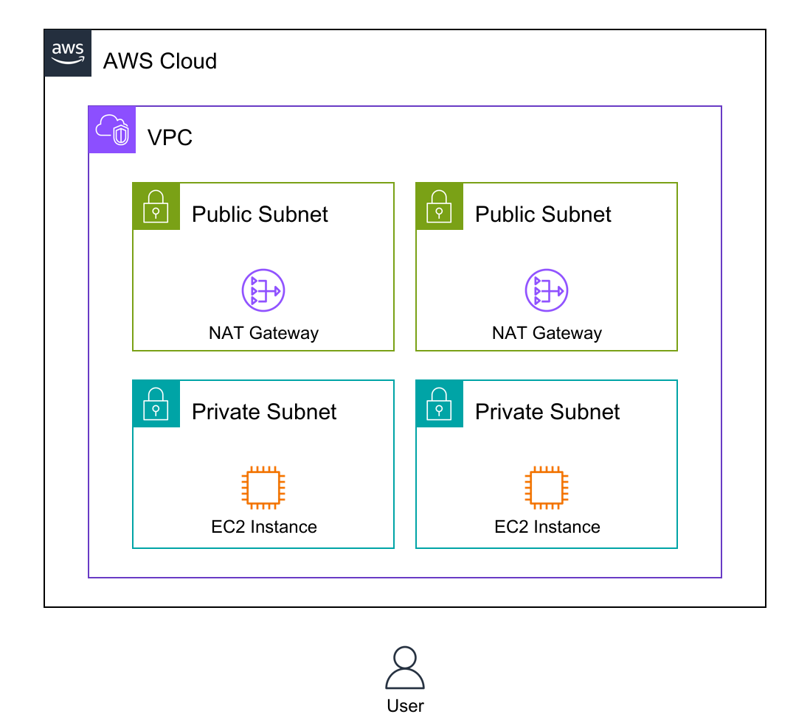

# Diagram-as-code
This command line interface (CLI) tool enables drawing infrastructure diagrams for Amazon Web Services through YAML code. It facilitates diagram-as-code without relying on image libraries.

The CLI tool promotes code reuse, testing, integration, and automating the diagramming process. It allows managing diagrams with Git by writing human-readable YAML.



(generated from [example of NAT Gateway](examples/vpc-natgw.yaml))

## Features
- **Compliant with AWS architecture guidelines**  
Easily generate diagrams that follow [AWS diagram guidelines](https://aws.amazon.com/architecture/icons).
- **Flexible**  
Automatically adjust the position and size of groups.
- **Lightweight & CI/CD-friendly**  
Start quickly on a container; no dependency on headless browser or GUI.
- **Integrate with your Infrastructure as Code**  
Generate diagrams to align with your IaC code without managing diagrams manually.
- **As a drawing library**  
Use as Golang Library and integrate with other IaC tools, AI, or drawing GUI tools.
- **Extensible**  
Add definition files to create non-AWS diagrams as well.

## Getting started
### for macOS user
In preparing.

### for Gopher
```
# go install github.com/awslabs/diagram-as-code/cmd/awsdac@latest
```

## Resource Types
See [doc/resource-types.md](doc/resource-types.md).

## Example Usage
See [examples templates](examples).

## Security

See [CONTRIBUTING](CONTRIBUTING.md#security-issue-notifications) for more information.

## License

This project is licensed under the Apache-2.0 License.
