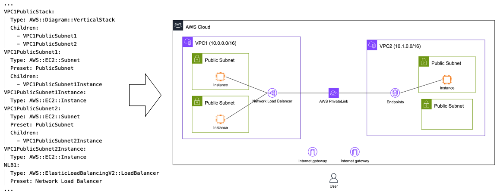
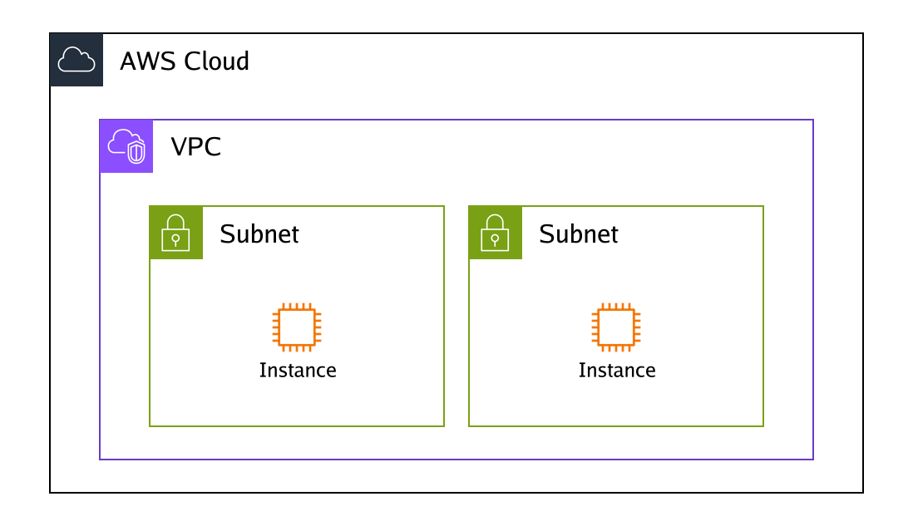

# Diagram-as-code
This command line interface (CLI) tool enables drawing infrastructure diagrams for Amazon Web Services through YAML code. It facilitates diagram-as-code without relying on image libraries.

The CLI tool promotes code reuse, testing, integration, and automating the diagramming process. It allows managing diagrams with Git by writing human-readable YAML.

Example templates are [here](examples).
Check out the [Introduction Guide](doc/introduction.md) as well for additional information.




## Getting started

### for Gopher (go 1.21 or higher)
```
$ go install github.com/awslabs/diagram-as-code/cmd/awsdac@latest
```

### for macOS user
```
$ brew install awsdac
```

## Usage

```
Usage:
  awsdac <input filename> [flags]

Flags:
  -c, --cfn-template               [beta] Create diagram from CloudFormation template
  -d, --dac-file                   [beta] Generate YAML file in dac (diagram-as-code) format from CloudFormation template
  -h, --help                       help for awsdac
  -o, --output string              Output file name (default "output.png")
      --override-def-file string   For testing purpose, override DefinitionFiles to another url/local file
  -t, --template                   Processes the input file as a template according to text/template.
  -v, --verbose                    Enable verbose logging
      --version                    version for awsdac
```

### Example

```
$ awsdac examples/alb-ec2.yaml
```

```
$ awsdac privatelink.yaml -o custom-output.png
```

### [Beta] Create a diagram from CloudFormation template

`--cfn-template` option allows you to generate diagrams from CloudFormation templates, providing a visual representation of the resources.
The tool can generate diagrams even if the CloudFormation template is not in a perfect format, enabling you to visualize the resources before actually creating the CloudFormation stack. This means you don't have to strictly adhere to the CloudFormation syntax constraints.

> **NOTE:** The functionality of generating diagrams from CloudFormation templates is currently in beta. It sometimes works correctly, but we are aware of several known issues where the tool might not produce accurate results. We are actively working on improving the tool and fixing these issues.

```
$ awsdac examples/vpc-subnet-ec2-cfn.yaml --cfn-template
```
(generated from [the example of VPC,Subnet,EC2](examples/vpc-subnet-ec2-cfn.yaml))



There are some patterns where the tool may not work as expected. You can find a list of known issues and their status on the [issue tracker](https://github.com/awslabs/diagram-as-code/labels/cfn-template%20feature).
Your feedback and issue reports are appreciated, as they will help enhance the tool's performance and accuracy.

#### Use "--dac-file" option

```
$ awsdac examples/vpc-subnet-ec2-cfn.yaml --cfn-template --dac-file
```
CloudFormation templates have various dependencies, and there is no simple parent-child relationship between resources. As a result, generating the desired diagram directly from the existing CloudFormation template formats can be challenging at this stage.
We considered utilizing Metadata or comments within the CloudFormation templates to include additional information. However, this approach would make the templates excessively long, and CloudFormation templates are primarily intended for resource creation and management rather than diagram generation. Additionally, combining different lifecycle components into a single CloudFormation template could make it difficult to manage and maintain.

Therefore, instead of directly generating diagrams from CloudFormation templates, you can create a separate YAML file from CloudFormation template and customize this YAML file.
This customized YAML file can then be used as input for `awsdac` to generate the desired architecture diagrams. By decoupling the diagram generation process from the CloudFormation template structure, this approach offers greater flexibility and customization while leveraging the specialized strengths of `awsdac`.
```
CloudFormation template --[awsdac]--> yaml file in awsdac format --[user custom]--> your desired diagram :)
```

## Features
- **Compliant with AWS architecture guidelines**  
Easily generate diagrams that follow [AWS diagram guidelines](https://aws.amazon.com/architecture/icons).
- **Flexible**  
Automatically adjust the position and size of groups.
- **Lightweight & CI/CD-friendly**  
Start quickly on a container; no dependency on headless browser or GUI.
- **Integrate with your Infrastructure as Code**  
Generate diagrams to align with your IaC code without managing diagrams manually.
- **As a drawing library**  
Use as Golang Library and integrate with other IaC tools, AI, or drawing GUI tools.
- **Extensible**  
Add definition files to create non-AWS diagrams as well.

## MCP Server Integration

The awsdac MCP server enables AI assistants and development tools to generate AWS architecture diagrams programmatically through the Model Context Protocol (MCP). This integration allows seamless diagram creation within your development workflow.

### Installation & MCP Client configuration

#### for macOS user
```bash
brew install awsdac
```

MCP Client configuration:
```json
{
  "mcpServers": {
    "awsdac-mcp-server": {
      "command": "/opt/homebrew/bin/awsdac-mcp-server"
    }
  }
}
```

MCP Client configuration with custom log:
```json
{
  "mcpServers": {
    "awsdac-mcp-server": {
      "command": "/opt/homebrew/bin/awsdac-mcp-server",
      "args": ["--log-file", "/path/to/custom/awsdac-mcp.log"]
    }
  }
}
```

#### for Gopher (go 1.21 or higher)
```bash
go install github.com/awslabs/diagram-as-code/cmd/awsdac-mcp-server@latest
```

```json
{
  "mcpServers": {
    "awsdac-mcp-server": {
      "command": "/Users/yourusername/go/bin/awsdac-mcp-server"
    }
  }
}
```

**Note:** Replace `/Users/yourusername` with your actual home directory path.

#### Finding your binary location
If you installed via `go install`, you can find the binary location using:

```bash
# Check if awsdac-mcp-server is in your PATH
which awsdac-mcp-server

# Or check common Go install locations
ls ~/go/bin/awsdac-mcp-server
ls $GOPATH/bin/awsdac-mcp-server  # if GOPATH is set
```

Use the path returned by these commands in your MCP client configuration.

#### Custom Log File (Optional)


### Available Tools

#### generateDiagram
Generates AWS architecture diagrams from YAML specifications and returns base64-encoded PNG images.

**Parameters:**
- `yamlContent` (required): Complete YAML specification following the diagram-as-code format

#### generateDiagramToFile
Same as `generateDiagram` but saves the image directly to a specified file path.

**Parameters:**
- `yamlContent` (required): Complete YAML specification
- `outputFilePath` (required): Path where the PNG file should be saved

#### getDiagramAsCodeFormat
Returns comprehensive format specification, examples, and best practices for creating diagram-as-code YAML files.

### Usage Examples

```
Generate an AWS architecture diagram showing a VPC with public and private subnets, an ALB, and EC2 instances.
```

However, if the MCP host cannot receive large-sized image data from the MCP server, please use generateDiagramToFile to save the image data directly to a file.

To save directly to a file:
```
Generate an AWS architecture diagram showing a VPC with public and private subnets, an ALB, and EC2 instances, then save it to /tmp/test-diagram.png.
```

### Troubleshooting

#### Connection Issues
- Verify the MCP server binary path in your configuration
- Check that the binary has execution permissions
- Review log files for error messages

#### Log Files
By default, logs are written to `/tmp/awsdac-mcp-server.log`.

To use a custom log file location, add the `--log-file` argument to your MCP client configuration:
```json
"args": ["--log-file", "/path/to/your/custom.log"]
```

Check the log file for detailed error messages and debugging information.

## Resource types
See [doc/resource-types.md](doc/resource-types.md).

## Resource Link
See [doc/links.md](doc/links.md).

## Security

See [CONTRIBUTING](CONTRIBUTING.md#security-issue-notifications) for more information.

## License

This project is licensed under the Apache-2.0 License.
