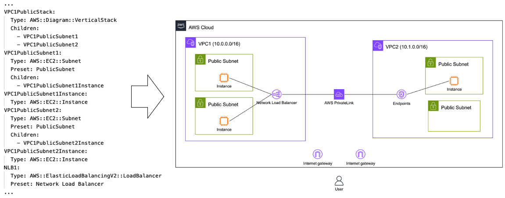

# Diagram-as-code
This command line interface (CLI) tool enables drawing infrastructure diagrams for Amazon Web Services through YAML code. It facilitates diagram-as-code without relying on image libraries.

The CLI tool promotes code reuse, testing, integration, and automating the diagramming process. It allows managing diagrams with Git by writing human-readable YAML.

Example templates are [here](examples).
Check out the [Introduction Guide](doc/introduction.md) as well for additional information.




## Features
- **Compliant with AWS architecture guidelines**  
Easily generate diagrams that follow [AWS diagram guidelines](https://aws.amazon.com/architecture/icons).
- **Flexible**  
Automatically adjust the position and size of groups.
- **Lightweight & CI/CD-friendly**  
Start quickly on a container; no dependency on headless browser or GUI.
- **Integrate with your Infrastructure as Code**  
Generate diagrams to align with your IaC code without managing diagrams manually.
- **As a drawing library**  
Use as Golang Library and integrate with other IaC tools, AI, or drawing GUI tools.
- **Extensible**  
Add definition files to create non-AWS diagrams as well.

## What's New In This Fork
- Added native `.drawio` export support through CLI:
  - `--drawio` flag
  - Automatic draw.io mode when `-o` ends with `.drawio`
- Added draw.io export pipeline in Go:
  - `internal/ctl/drawio.go`
  - `internal/ctl/drawio_assets.go`
- Added conversion helper script:
  - `tools/dac-to-drawio.py`
- Added local ignore rules for generated files and local tooling:
  - `diagrams/*`
  - `.claude/`

## Getting started

### for Gopher (go 1.21 or higher)
```
$ go install github.com/awslabs/diagram-as-code/cmd/awsdac@latest
```

### for macOS user
```
$ brew install awsdac
```

## Usage

```
Usage:
  awsdac <input filename> [flags]

Flags:
      --allow-untrusted-definitions  Allow loading definition files from untrusted URLs (not from official repository)
  -c, --cfn-template               [beta] Create diagram from CloudFormation template
  -d, --dac-file                   [beta] Generate YAML file in dac (diagram-as-code) format from CloudFormation template
      --drawio                     Generate draw.io (.drawio) file instead of PNG
  -f, --force                      Overwrite output file without confirmation
  -h, --help                       help for awsdac
      --height int                 Resize output image height (0 means no resizing)
  -o, --output string              Output file name (default "output.png")
      --override-def-file string   For testing purpose, override DefinitionFiles to another url/local file
  -t, --template                   Processes the input file as a template according to text/template.
  -v, --verbose                    Enable verbose logging
      --version                    version for awsdac
      --width int                  Resize output image width (0 means no resizing)
```

### Example

```
$ awsdac examples/alb-ec2.yaml
```

```
$ awsdac privatelink.yaml -o custom-output.png
```

```
$ awsdac examples/alb-ec2.yaml --drawio -o output.drawio
```

```
$ awsdac examples/alb-ec2.yaml -o output.drawio
```

## How Draw.io Export Works
1. The YAML file is parsed with the same resource/link model used by PNG rendering.
2. The same layout engine is executed (`Scale` and `ZeroAdjust`) to keep geometry consistent.
3. Children are reordered from link topology to keep ordering aligned with PNG output.
4. Resources are exported as draw.io cells and links are exported as draw.io edges in `mxGraphModel`.
5. Official AWS SVG icons are loaded from the AWS Asset Package and embedded as data URIs for leaf resources.

## Documentation

### Getting Started
- **[Introduction Guide](doc/introduction.md)** - Quick start (10 minutes) and core concepts
- **[Troubleshooting](doc/troubleshooting.md)** - Common issues and solutions

### Core Features
- **[Resource Types](doc/resource-types.md)** - Available AWS resources and diagram elements
- **[Links](doc/links.md)** - Connecting resources with arrows and lines

### Tools & Integration
- **[MCP Server](doc/mcp-server.md)** - AI assistant integration
- **[CloudFormation Conversion](doc/cloudformation.md)** [Beta] - Convert CloudFormation templates to diagrams

### Advanced Features
- **[Templates](doc/template.md)** - Using Go templates for dynamic diagrams
- **[UnorderedChildren](doc/advanced/unordered-children.md)** - Automatic child reordering for optimal layouts
- **[Auto-positioning](doc/advanced/auto-positioning.md)** - Smart link positioning
- **[Link Grouping Offset](doc/advanced/link-grouping.md)** - Prevent link overlap
- **[BorderChildren](doc/advanced/border-children.md)** - Place resources on borders

### Guides
- **[Best Practices](doc/best-practices.md)** - Design patterns and diagram standards
- **[Gitflow Workflow](doc/gitflow.md)** - Branching model for PRs, tests, review, and release flow
- **[AI Documentation](doc/ai/README.md)** - Context, architecture, guardrails, and development model for AI agents
- **[Agent Entry Point](AGENTS.md)** - Primary project instructions for coding agents

### Contributing
- **[Documentation Guidelines](doc/contributing-docs.md)** - How to contribute to documentation

---

## Development Guide

For contributing guidelines, please see [CONTRIBUTING.md](CONTRIBUTING.md).

### Project Structure
- `cmd/` - CLI tools (awsdac, awsdac-mcp-server)
- `internal/` - Core implementation
  - `cache/` - Caching logic
  - `ctl/` - Core control logic
  - `definition/` - Definition file handling
  - `font/` - Font management
  - `types/` - Core types and structures
  - `vector/` - Vector operations
- `test/` - Integration tests
- `tools/` - Development tools
- `examples/` - Example YAML files
- `doc/` - Documentation

## Security

See [CONTRIBUTING](CONTRIBUTING.md#security-issue-notifications) for more information.

## License

This project is licensed under the Apache-2.0 License.
