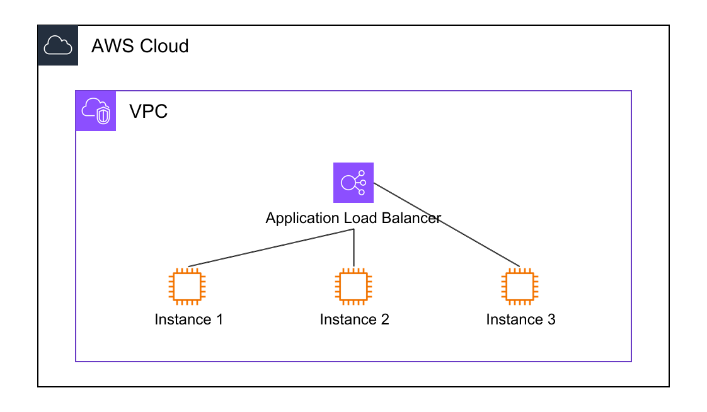

# Auto-positioning

Automatic link position calculation for optimal diagram layouts.

## Overview

Auto-positioning automatically determines the best connection points for links based on resource positions, eliminating the need to manually specify `SourcePosition` and `TargetPosition`.

## Usage

### Default Behavior

Links use auto-positioning by default when positions are not specified:

```yaml
Links:
  - Source: ALB
    Target: Instance1
```

### Explicit Auto-positioning

```yaml
Links:
  - Source: ALB
    SourcePosition: auto
    Target: Instance2
    TargetPosition: auto
```

### Mixed Positioning

Combine manual and automatic positioning:

```yaml
Links:
  - Source: ALB
    SourcePosition: E      # Manual
    Target: Instance3
    TargetPosition: auto   # Automatic
```



## How It Works

The auto-positioning algorithm intelligently selects connection points based on resource relationships in the diagram hierarchy:

### Hierarchy-Based Selection

1. **Finds Lowest Common Ancestor (LCA)**: Identifies the nearest common parent of source and target resources in the tree structure

2. **Considers container direction**: Uses the LCA's `Direction` property (`vertical` or `horizontal`) to prioritize appropriate positions

3. **Counts resources in each direction**: Analyzes resource density (N, E, W, S) to avoid overlapping with existing resources

4. **Selects optimal positions**: 
   - Prefers directions with fewer resources (minimizes overlap)
   - Aligns with container direction (maintains layout flow)
   - Uses relative position between source and target (shortest path)

### Special Cases

- **BorderChildren**: Automatically uses inside/outside positions based on parent relationship
- **No common ancestor**: Falls back to distance-based calculation

This approach ensures links follow the diagram's logical structure while minimizing visual clutter.

## When to Use

**Use auto-positioning when**:
- Creating new diagrams quickly
- Resource positions may change
- Optimal positions are obvious

**Use manual positioning when**:
- Precise control needed
- Multiple links from same resource
- Specific aesthetic requirements

## Related Documentation

- [Links](../links.md) - Link basics
- [UnorderedChildren](unordered-children.md) - Automatic resource reordering
- [Link Grouping](link-grouping.md) - Prevent link overlap
