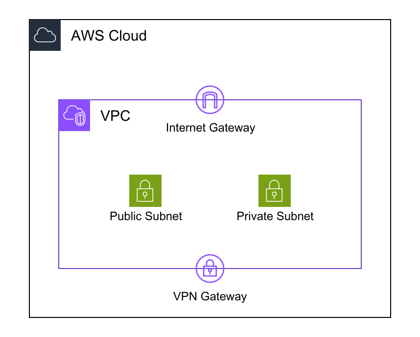
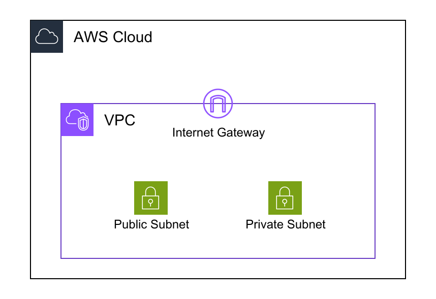

# BorderChildren

Place resources on the borders of their parent container.

## Overview

BorderChildren allows you to position resources on the edges (North, South, East, West) of their parent container, useful for gateways, load balancers, and boundary resources.

## Usage

```yaml
Resources:
  VPC:
    Type: AWS::EC2::VPC
    BorderChildren:
      - Position: N
        Resource: InternetGateway
      - Position: S
        Resource: VPNGateway
    Children:
      - PublicSubnet
      - PrivateSubnet
      
  InternetGateway:
    Type: AWS::EC2::InternetGateway
    
  VPNGateway:
    Type: AWS::EC2::VPNGateway
```



## Positions

Available positions:
- `N` (North) - Top edge
- `S` (South) - Bottom edge
- `E` (East) - Right edge
- `W` (West) - Left edge

## Common Use Cases

### Internet Gateway

```yaml
VPC:
  Type: AWS::EC2::VPC
  BorderChildren:
    - Position: N
      Resource: IGW
```

### VPN Gateway

```yaml
VPC:
  Type: AWS::EC2::VPC
  BorderChildren:
    - Position: S
      Resource: VPNGateway
```

### Transit Gateway Attachment

```yaml
VPC:
  Type: AWS::EC2::VPC
  BorderChildren:
    - Position: W
      Resource: TGWAttachment
```

## Related Documentation

- [Resource Types](../resource-types.md) - Resource basics
- [Best Practices](../best-practices.md) - Design patterns

## Advanced Usage

### Fill Transparent Icon Background

Border children with transparent icons may look unclear. Use `IconFill` with `Type: rect` to fill the background:

```yaml
VPC:
  Type: AWS::EC2::VPC
  BorderChildren:
    - Position: N
      Resource: IGW
  Children:
    - Subnets

IGW:
  Type: AWS::EC2::InternetGateway
  IconFill:
    Type: rect
  Title: "Internet Gateway"
```



This makes transparent icons more visible and cleaner in the diagram.
