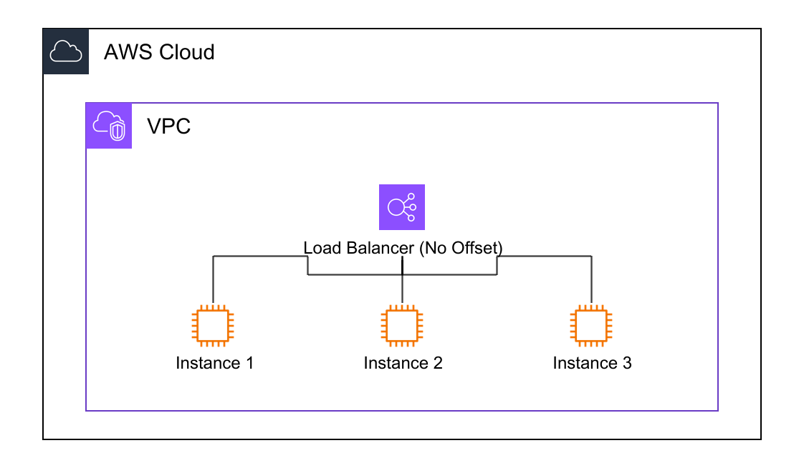
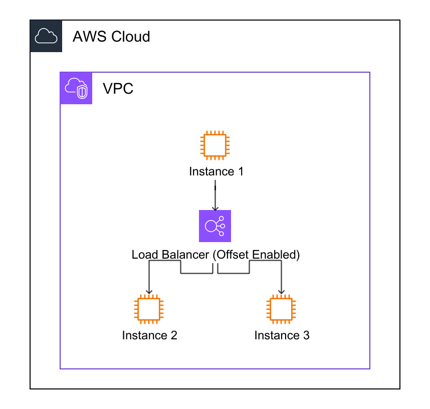
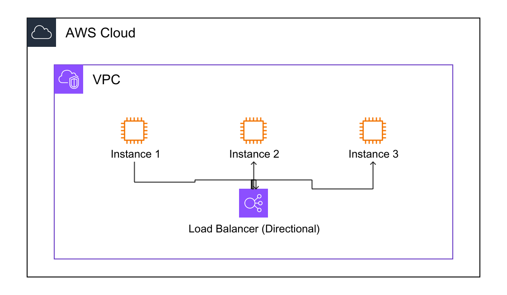

# Link Grouping Offset

Prevent link overlap when multiple links originate from or terminate at the same position.

## Overview

When multiple links share the same source or target position, they can overlap and become difficult to distinguish. Link grouping offset automatically spreads these links apart.

## Comparison

### 1. Disabled (Default)

Links overlap when originating from the same position:



### 2. GroupingOffset Enabled

Links are spread vertically (perpendicular to link direction):

```yaml
Resources:
  ELB:
    Type: AWS::ElasticLoadBalancingV2::LoadBalancer
    Options:
      GroupingOffset: true
```



### 3. GroupingOffsetDirection Enabled

Links are grouped by target direction for more organized layouts:

```yaml
Resources:
  ELB:
    Type: AWS::ElasticLoadBalancingV2::LoadBalancer
    Options:
      GroupingOffset: true
      GroupingOffsetDirection: true
```



## How It Works

- Links from the same position are offset by ±5px, ±10px, etc.
- Links are sorted by target/source position for consistent ordering
- Offset is applied perpendicular to the link direction
- Calculation: `(index - (count-1)/2.0) * 10` pixels
- **Directional mode**: Groups links by target direction before applying offset

## When to Use

**Enable when**:
- Multiple links from same resource position
- Links overlap and are hard to distinguish
- Load balancer to multiple instances

**Disable when** (default):
- Single link per position
- Manual positioning preferred
- Offset causes layout issues

## Related Documentation

- [Links](../links.md) - Link basics
- [Auto-positioning](auto-positioning.md) - Automatic link positioning
