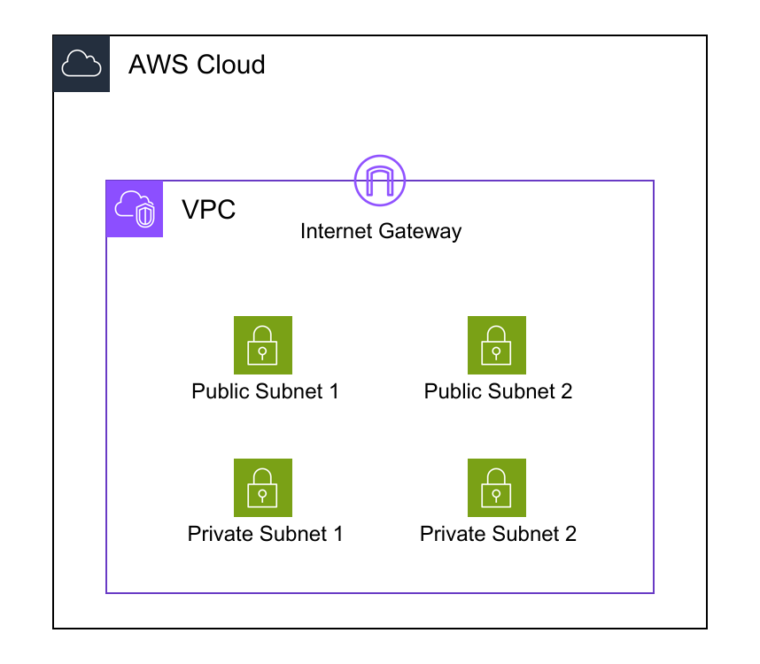

# Best Practices

Design patterns and standards for creating effective AWS architecture diagrams.

## Diagram Types

### 1. Action Flow Diagrams
Show how user actions flow through your system.

**Characteristics**:
- Start with user or external trigger
- Show request/response flow
- Include protocol information (HTTP, HTTPS)
- Label arrows with request types

**When to use**: API documentation, user journey visualization

### 2. Infrastructure Diagrams
Focus on network topology and resource relationships.

**Characteristics**:
- Emphasize VPC, subnets, and network boundaries
- Show security groups and network ACLs
- Include routing information
- Use North-South orientation (external at top, internal at bottom)

**When to use**: Network planning, security reviews

### 3. Management Diagrams
Show administrative access and monitoring.

**Characteristics**:
- Start with administrator
- Show management tools (Console, CLI, SSM)
- Include monitoring and logging services
- Emphasize observability

**When to use**: Operations documentation, troubleshooting guides

## Architecture and Tree Structure

### Parent-Child Relationships

Follow AWS resource hierarchy:
```
Canvas → AWS Cloud → Region → VPC → Subnet → Instance
```

### Tree Structure Planning

Before creating diagrams, plan your tree structure:
1. Identify root resource (usually user or external service)
2. Map dependencies from root to leaves
3. Group related resources

## Design Tips

### Direction and Resource Placement

**North-South Convention**:
- North (top): External users, internet
- South (bottom): Internal resources, administrators
- East-West (horizontal): Redundancy, availability zones

**Example**:
```yaml
VPC:
  Direction: "vertical"
  Children:
    - InternetGateway  # North
    - PublicSubnets    # Middle
    - PrivateSubnets   # South
```



### Redundancy Layers

**Horizontal Redundancy** (for North-South traffic):
```yaml
PublicSubnets:
  Type: AWS::Diagram::HorizontalStack
  Children:
    - PublicSubnet1
    - PublicSubnet2
```

**Vertical Redundancy** (for East-West traffic):
```yaml
Subnets:
  Type: AWS::Diagram::VerticalStack
  Children:
    - PublicSubnets
    - PrivateSubnets
```

### Grouping Strategies

Group resources by:
- Function (web tier, app tier, data tier)
- Environment (dev, staging, prod)
- Availability zone
- Security boundary

## Maintainability

### YAML Organization

**Use comments**:
```yaml
# Web Tier Resources
WebTier:
  Type: AWS::Diagram::VerticalStack
  Children:
    - ALB
    - WebInstances
```

**Consistent naming**:
- Use descriptive names: `WebServerInstance` not `Instance1`
- Follow conventions: `PublicSubnet1`, `PublicSubnet2`
- Include environment: `ProdVPC`, `DevVPC`

### File Structure

For large projects:
- Split diagrams by environment
- Use templates for repeated patterns
- Version control all YAML files

## Related Documentation

- [Introduction Guide](introduction.md)
- [Resource Types](resource-types.md)
- [Links](links.md)
- [Large Diagrams Guide](guides/large-diagrams.md)
- [Layout Strategies](guides/layout-strategies.md)
