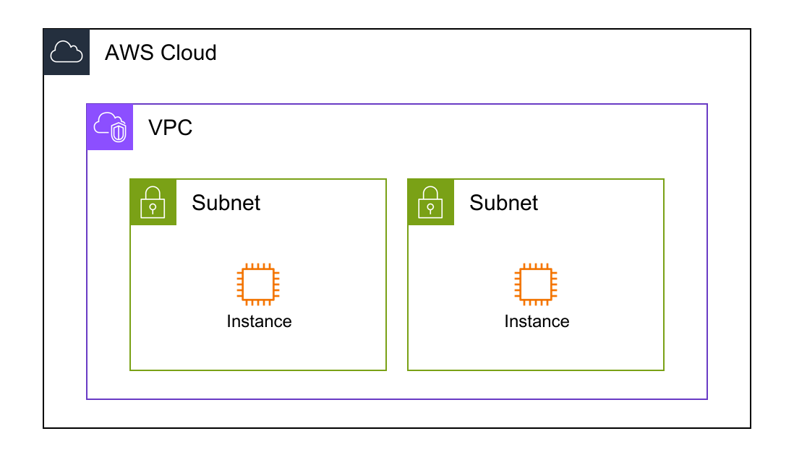

# CloudFormation Conversion [Beta]

Convert CloudFormation templates to diagram-as-code diagrams.

> **Beta Feature**: This functionality is currently in beta. It sometimes works correctly, but we are aware of several known issues. See [known issues](https://github.com/awslabs/diagram-as-code/labels/cfn-template%20feature) for current status.

## Overview

The `--cfn-template` option allows you to generate diagrams from CloudFormation templates, providing a visual representation of your infrastructure before deployment.

**Two workflows available**:
1. **Direct Conversion**: Generate diagram directly from CloudFormation template
2. **DAC File Generation**: Create editable YAML file for customization

## Direct Conversion Workflow

Generate a diagram directly from your CloudFormation template.

### Usage

```bash
awsdac template.yaml --cfn-template
```

**Output**: `output.png` (default filename)

### Custom Output Filename

```bash
awsdac template.yaml --cfn-template -o my-architecture.png
```

**Example output**:



### When to Use

- Quick visualization of CloudFormation resources
- Initial diagram generation
- Simple templates with clear resource relationships

### Limitations

- Layout may not be optimal for complex templates
- Some CloudFormation features not yet supported
- Resource positioning is automatic and cannot be customized in this mode

## DAC File Generation Workflow

Generate an editable YAML file that you can customize before creating the final diagram.

**Workflow**:
```
CloudFormation template --[awsdac]--> DAC YAML file --[customize]--> Final diagram
```

This approach offers greater flexibility by decoupling diagram generation from CloudFormation template structure.

### Usage

```bash
awsdac template.yaml --cfn-template --dac-file
```

**Outputs**:
- `output.yaml` - Editable DAC file
- `output.png` - Initial diagram

### Customization Process

1. **Generate DAC file**:
   ```bash
   awsdac template.yaml --cfn-template --dac-file -o custom.yaml
   ```

2. **Edit the DAC file** (`custom.yaml`):
   - Adjust resource positioning
   - Add/remove resources
   - Customize titles and labels
   - Modify link connections

3. **Generate final diagram**:
   ```bash
   awsdac custom.yaml -o final-diagram.png
   ```

### When to Use

- Complex CloudFormation templates
- Need precise control over diagram layout
- Want to add custom annotations
- Generated diagram needs improvement

## Known Issues

CloudFormation templates have various dependencies and complex relationships. Some patterns may not work as expected.

**Current known issues**:
- Complex nested stacks may not render correctly
- Some resource dependencies are not automatically detected
- Custom resources are not supported

**Track issues**: [GitHub Issue Tracker](https://github.com/awslabs/diagram-as-code/labels/cfn-template%20feature)

**Report new issues**: Your feedback helps improve the tool!

## Examples

### Example 1: Simple VPC with Subnets

**CloudFormation template** (`vpc-simple.yaml`):
```yaml
Resources:
  MyVPC:
    Type: AWS::EC2::VPC
  PublicSubnet:
    Type: AWS::EC2::Subnet
  PrivateSubnet:
    Type: AWS::EC2::Subnet
```

**Generate diagram**:
```bash
awsdac vpc-simple.yaml --cfn-template
```

### Example 2: Web Application with ALB

**Generate and customize**:
```bash
# Generate DAC file
awsdac web-app.yaml --cfn-template --dac-file -o web-app-dac.yaml

# Edit web-app-dac.yaml to improve layout

# Generate final diagram
awsdac web-app-dac.yaml -o web-app-final.png
```

## Related Documentation

- **[Introduction Guide](introduction.md)** - Learn diagram-as-code basics
- **[Resource Types](resource-types.md)** - Available AWS resources
- **[Best Practices](best-practices.md)** - Diagram design patterns
- **[Troubleshooting](troubleshooting.md)** - Common issues and solutions
