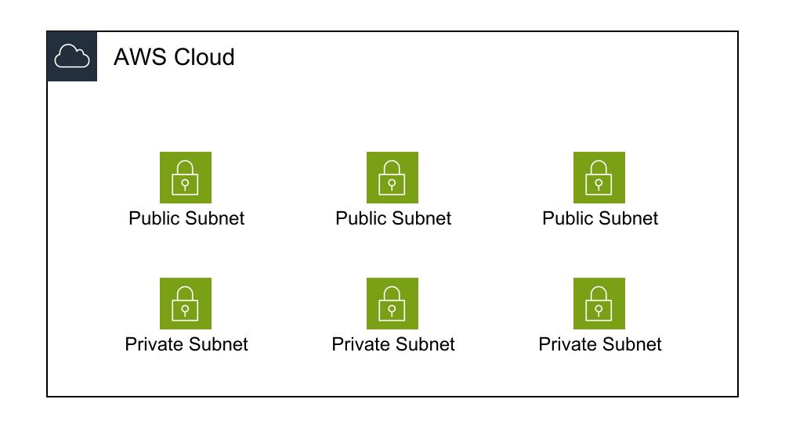

# Large Diagrams

Strategies for creating and managing large-scale AWS architecture diagrams.

## Challenges

Large diagrams (>50 resources) face:
- Visual complexity and clutter
- Difficult to understand at a glance
- Hard to maintain
- Performance issues

## Strategies

### 1. Split by Concern

Divide into multiple focused diagrams:
- **Network diagram**: VPCs, subnets, routing
- **Application diagram**: Services, APIs, data flow
- **Security diagram**: IAM, security groups, encryption

### 2. Use Abstraction Layers

Show different levels of detail:
- **High-level**: Major components only
- **Mid-level**: Component groups
- **Low-level**: Individual resources

### 3. Group Related Resources

```yaml
WebTier:
  Type: AWS::Diagram::VerticalStack
  Title: "Web Tier (10 instances)"
  # Don't show all 10 instances, represent as group
```

### 4. Limit Link Density

Show only critical connections:
- Primary data flow
- External integrations
- Cross-AZ connections

Omit:
- Implicit connections (subnet to VPC)
- Redundant paths
- Internal service mesh

### 5. Use Templates

For repeated patterns:
```yaml
{{- range $i := seq 3}}
AZ{{$i}}:
  Type: AWS::Diagram::VerticalStack
  Children:
    - PublicSubnet{{$i}}
    - PrivateSubnet{{$i}}
{{- end}}
```



## Best Practices

1. **Start simple**: Begin with high-level, add detail as needed
2. **Use consistent naming**: Makes large diagrams easier to navigate
3. **Add documentation**: Include README explaining diagram scope
4. **Version control**: Track changes to large diagrams carefully
5. **Regular reviews**: Keep diagrams up-to-date with architecture

## Related Documentation

- [Templates](../template.md) - Using Go templates
- [Best Practices](../best-practices.md) - Design patterns
- [Layout Strategies](layout-strategies.md) - Optimization techniques
