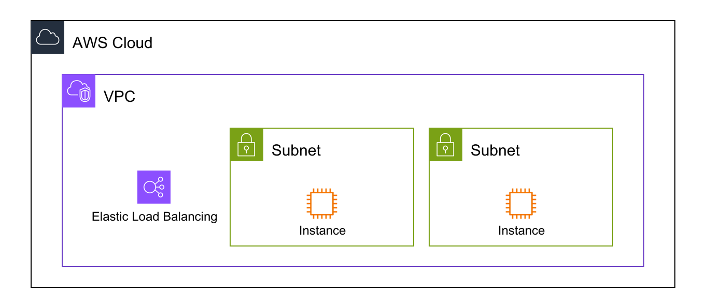
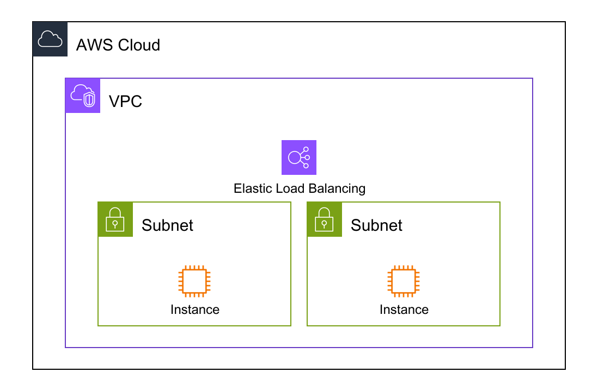
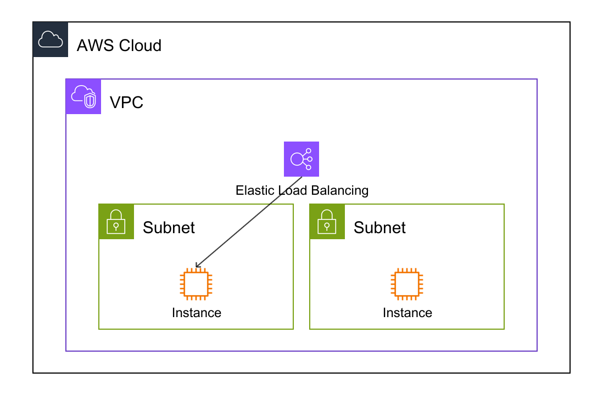
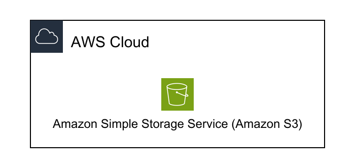
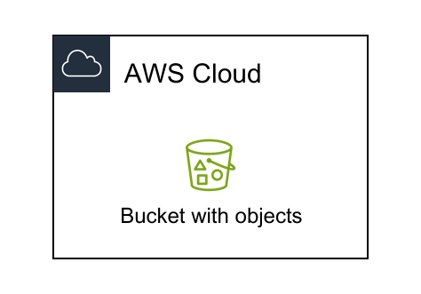
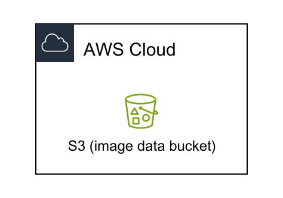

# Introduction Guide

- [Introduction Guide](#introduction-guide)
  - [How to Install](#how-to-install)
    - [Your First Diagram](#your-first-diagram)
  - [Understanding DAC (diagram as code) File / How to Make Input File](#understanding-dac-diagram-as-code-file--how-to-make-input-file)
    - [DefinitionFiles section](#definitionfiles-section)
    - [Resources section](#resources-section)
    - [Links section](#links-section)
  - [\[Beta\] Create Diagrams from CloudFormation template](#beta-create-diagrams-from-cloudformation-template)
    - [Create DAC files from CloudFormation template](#create-dac-files-from-cloudformation-template)
  - [Tips](#tips)
    - [How to Change default icons](#how-to-change-default-icons)
    - [How to Change default titles](#how-to-change-default-titles)


## How to Install

```
$ go install github.com/awslabs/diagram-as-code/cmd/awsdac@latest
```

### Your First Diagram

```
$ awsdac https://raw.githubusercontent.com/awslabs/diagram-as-code/main/examples/alb-ec2.yaml
[Completed] AWS infrastructure diagram generated: output.png
```
You can confirm the generated diagram when you open `output.png` file. ※ This name is the default. You can change the name with "-o" option.

## Understanding DAC (diagram as code) File / How to Make Input File

To create diagrams with `awsdac`, you need to provide a "DAC (diagram as code) file" that defines the components and layout of your architecture. The DAC file uses YAML syntax and consists of 3 main sections:
```
Diagram:
    DefinitionFiles:  # Specify the location of the definition file
      ...
    Resources:        # Define your AWS resources here
      ...
    Links:            # Define connections between resources
      ...
```

### DefinitionFiles section

To use the pre-defined resource definitions from the awsdac GitHub repository, specify the URL in the DefinitionFiles section:
```
    DefinitionFiles:
      - Type: URL
        Url: https://raw.githubusercontent.com/awslabs/diagram-as-code/main/definitions/definition-for-aws-icons-light.yaml
```

If you want to customize the resource definitions locally, you can specify a local file path instead:
```
    DefinitionFiles:
      - Type: LocalFile
        LocalFile: "<your definition file path (e.g. ~/Desktop/your-custom-definition.yaml)>"
```

### Resources section

`awsdac` has a unique feature where it provides resource types such as `AWS::Diagram::Canvas` and `AWS::Diagram::Cloud`, but you can define other AWS resources in a similar way to CloudFormation resource types.
And these resources are associated with each other by listing them under the "Children" property.

```
    Resources:
        Canvas:
            Type: AWS::Diagram::Canvas
            Children:
                - AWSCloud
        AWSCloud:
            Type: AWS::Diagram::Cloud
            Preset: AWSCloudNoLogo
            Children:
                - VPC
        VPC:
            Type: AWS::EC2::VPC
            Children:
                - ELB            
                - Subnet1
                - Subnet2
        ELB:
            Type: AWS::ElasticLoadBalancingV2::LoadBalancer                
        Subnet1:
            Type: AWS::EC2::Subnet
            Children:
                - EC2Instance1
        Subnet2:
            Type: AWS::EC2::Subnet
            Children:
                - EC2Instance2
        EC2Instance1:
            Type: AWS::EC2::Instance
        EC2Instance2:
            Type: AWS::EC2::Instance
```

However, if you use the above file, the resulting diagram will have the ELB on the same layer as the subnets, like this:

<p align="center">

</p>

If you want to have more control over the positioning of AWS resources, such as placing the ELB in front of the subnets, you can define `AWS::Diagram::VerticalStack` or `AWS::Diagram::HorizontalStack` resources to group other resources.
For example, in this case, you could:
 * Group the 2 subnets together by creating an AWS::Diagram::HorizontalStack resource
 * Define the VPC resource to have the `AWS::Diagram::HorizontalStack` and the ELB resource as its Children
 * Set the Direction of the VPC resource to "vertical" so that the resources under the VPC are stacked vertically (note: the default value for the Direction property is "horizontal")

```diff
    Resources:
        ...
        VPC:
            Type: AWS::EC2::VPC
+           Direction: "vertical"
            Children:
                - ELB
+               - HorizontalStackGroup
-                - Subnet1
-                - Subnet2
        ...
+       HorizontalStackGroup:
+           Type: AWS::Diagram::HorizontalStack
+           Children:
+               - Subnet1
+               - Subnet2
        ...
```

<p align="center">

</p>

For more detailed information about "Resources" section, please refer to: [resource-types.md](resource-types.md)

### Links section

You can draw a line between the resource specified as the Source and the resource specified as the Target. At this time, you can define "where the line is drawn on the icon" by specifying SourcePosition or TargetPosition.
For example, if you make the following definition, you will get a diagram like this:

```
    Links:
      - Source: ELB
        SourcePosition: S     # "S" (South) for SourcePosition means the line begins from the bottom of the icon
        Target: EC2Instance1
        TargetPosition: N     # "N" (North) for TargetPosition means the line ends at the top of the icon
        TargetArrowHead:
            Type: Open
```

<p align="center">

</p>

For more detailed information about Links, please refer to: [links.md](links.md)

## [Beta] Create Diagrams from CloudFormation template

`--cfn-template` option allows you to generate diagrams from CloudFormation templates, providing a visual representation of the resources.
The tool can generate diagrams even if the CloudFormation template is not in a perfect format, enabling you to visualize the resources before actually creating the CloudFormation stack. This means you don't have to strictly adhere to the CloudFormation syntax constraints.

```
$ awsdac <input your CloudFormation template (YAML format)> --cfn-template
[Completed] AWS infrastructure diagram generated: output.png
```

However, we recognize there are some issues in this feature; [issue tracker](https://github.com/awslabs/diagram-as-code/labels/cfn-template%20feature).

CloudFormation templates have various dependencies, and there is no simple parent-child relationship between resources. As a result, generating the desired diagram directly from the existing CloudFormation template formats can be challenging at this stage. 
If the generated diagram is not what you want, please go to the next section.

### Create DAC files from CloudFormation template

Instead of directly generating diagrams from CloudFormation templates, you can create a separate YAML file (DAC file) from CloudFormation template and customize this YAML file.

```
$ awsdac <input your CloudFormation template (YAML format)> --cfn-template --dac-file 
[Completed] dac (diagram-as-code) data written to output.yaml
[Completed] AWS infrastructure diagram generated: output.png
```
You can confirm the generated DAC file when you open `output.yaml` file. ※ This name is the default. You can change the name with "-o" option.

For example, if you use [example/vpc-subnet-ec2-cfn.yaml](../examples/vpc-subnet-ec2-cfn.yaml), you can get the DAC file as follows:
```
Diagram:
    DefinitionFiles:
        - Type: URL
          Url: https://raw.githubusercontent.com/awslabs/diagram-as-code/main/definitions/definition-for-aws-icons-light.yaml
          LocalFile: ""
          Embed:
            Definitions: {}
    Resources:
        AWSCloud:
            Type: AWS::Diagram::Cloud
            Icon: ""
            Direction: ""
            Preset: AWSCloudNoLogo
            Align: center
            FillColor: ""
            Title: ""
            TitleColor: ""
            Font: ""
            Children:
                - VPC
        ...
        VPC:
            Type: AWS::EC2::VPC
            Icon: ""
            Direction: ""
            Preset: ""
            Align: ""
            FillColor: ""
            Title: ""
            TitleColor: ""
            Font: ""
            Children:
                - Subnet1
                - Subnet2
    Links: []
```
The DAC file obtained can be customized according to your needs by commenting out or removing unnecessary parameters within the file. This allows you to tailor the configuration to your specific requirements.

## Tips

### How to Change default icons

You can set the "Preset" parameter in DAC file and search values from the [definition file](https://github.com/awslabs/diagram-as-code/blob/main/definitions/definition-for-aws-icons-light.yaml).

Ex)

Default
```
Diagram:
  DefinitionFiles:
    - Type: URL
      Url: "https://raw.githubusercontent.com/awslabs/diagram-as-code/main/definitions/definition-for-aws-icons-light.yaml"

  Resources:
    Canvas:
      Type: AWS::Diagram::Canvas
      Direction: vertical
      Children:
        - AWSCloud
    AWSCloud:
      Type: AWS::Diagram::Cloud
      Direction: vertical
      Preset: AWSCloudNoLogo
      Align: center
      Children:
        - S3
    S3:
      Type: AWS::S3::Bucket
```

<p align="center">

</p>

Set "Preset" parameter and "Bucket with objects" value
```diff
Diagram:
  ...

  Resources:
    ...
    S3:
      Type: AWS::S3::Bucket
+     Preset: "Bucket with objects"
```

<p align="center">

</p>

### How to Change default titles

You can set the "Title" parameter in DAC file.

Ex)
```diff
Diagram:
  ...

  Resources:
    ...
    S3:
      Type: AWS::S3::Bucket
+     Preset: "Bucket with objects"
+     Title: "S3 (image data bucket)" 
```

<p align="center">

</p>
