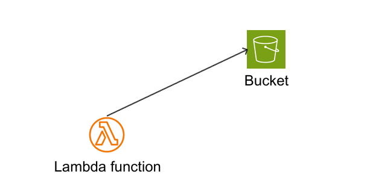
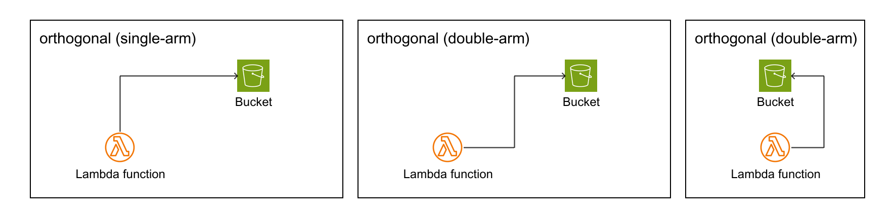

## Links

Links are lines that show relationships between resources. Currently supports a straight line between resources.

### Link position

The start and end points of the line specify the location as the 16-wind rose of the resource (for example, NNW).


```
Diagrams:
  Resources:
    ALB: ...
    PublicSubnet1Instance: ...
  Links:
    - Source: ALB # (required)
      SourcePosition: NNE # (required)
      Target: PublicSubnet1Instance # (required)
      TargetPosition: S # (required)
      LineWidth: 1 # (optional)
      LineColor: 'rgba(255,255,255,255)' # (optional)
      LineStyle: `normal|dashed` (optional)
```

### Auto-positioning

**New Feature**: Links can automatically determine optimal connection points based on resource positions, eliminating the need to manually specify `SourcePosition` and `TargetPosition`.

```yaml
Links:
  # Default behavior - auto-positioning
  - Source: ALB
    Target: Instance1
    
  # Explicit auto-positioning
  - Source: ALB
    SourcePosition: auto
    Target: Instance2
    TargetPosition: auto
    
  # Mixed positioning - manual source, auto target
  - Source: ALB
    SourcePosition: E
    Target: Instance3
    TargetPosition: auto
    
  # Traditional manual positioning (still supported)
  - Source: ALB
    SourcePosition: NNE
    Target: Instance4
    TargetPosition: S
```

### Link type

#### Straight

```
  Links:
    - Source: StraightLambda
      SourcePosition: N
      Target: StraightBucket
      TargetPosition: W
      TargetArrowHead:
        Type: Open
```

#### Orthogonal

```
  Links:
      # Orthogonal (single-arm)
    - Source: Orthogonal1Lambda
      SourcePosition: N
      Target: Orthogonal1Bucket
      TargetPosition: W
      TargetArrowHead:
        Type: Open
      Type: orthogonal

      # Orthogonal (double-arm)
    - Source: Orthogonal2Lambda
      SourcePosition: E
      Target: Orthogonal2Bucket
      TargetPosition: W
      TargetArrowHead:
        Type: Open
      Type: orthogonal

      # Orthogonal (double-arm)
    - Source: Orthogonal3Lambda
      SourcePosition: E
      Target: Orthogonal3Bucket
      TargetPosition: E
      TargetArrowHead:
        Type: Open
      Type: orthogonal
```

For orthogonal links with auto-positioning labels (`AutoRight` and `AutoLeft`), the system automatically detects the longest horizontal segment among the control points and places labels along that segment for optimal readability. The system intelligently avoids acute angles by selecting appropriate segments based on the path geometry.


### Arrow head

Arrows add context and meaning to a diagram by indicating the direction of flow.


(generated from [static/arrows.yaml](static/arrows.yaml))

```
    - Source: ALB
      SourcePosition: NNW
      SourceArrowHead: #(optional)
        Type: Open #(required) Open/Default
        Width: Default #  (optional) Narrow/Default/Wide default="Default"
        Length: 2 # (optional) default=2
      Target: VPCPublicSubnet1Instance
      TargetPosition: SSE
      TargetArrowHead: #(optional)
        Type: Open #(required) Open/Default
        Width: Default #  (optional) Narrow/Default/Wide default="Default"
        Length: 2 # (optional) default=2
```

### Link Labels

Link Labels add labels along the link

```
  Links:
    - Source: ALB # (required)
      SourcePosition: NNE # (required)
      Target: PublicSubnet1Instance # (required)
      TargetPosition: S # (required)
      Labels: (optional)
        SourceLeft: (optional)
          Type: (optional, default: horizontal, allowed: horizontal) 
          Title: (required on SourceLeft, default: ``)
          Color: (optional, default: `` inherit from Source,Target font color)
          Font: (optional, default: `` inherit from Source,Target font name)
        SourceRight: (optional)
          Type: (optional, default: horizontal, allowed: horizontal) 
          Title: (required on SourceRight, default: ``)
          Color: (optional, default: `` inherit from Source,Target font color)
          Font: (optional, default: `` inherit from Source,Target font name)
        TargetLeft: (optional)
          Type: (optional, default: horizontal, allowed: horizontal) 
          Title: (required on TargetLeft, default: ``)
          Color: (optional, default: `` inherit from Source,Target font color)
          Font: (optional, default: `` inherit from Source,Target font name)
        TargetRight: (optional)
          Type: (optional, default: horizontal, allowed: horizontal) 
          Title: (required on TargetRight, default: ``)
          Color: (optional, default: `` inherit from Source,Target font color)
          Font: (optional, default: `` inherit from Source,Target font name)
        AutoRight: (optional)
          Type: (optional, default: horizontal, allowed: horizontal) 
          Title: (required on AutoRight, default: ``)
          Color: (optional, default: `` inherit from Source,Target font color)
          Font: (optional, default: `` inherit from Source,Target font name)
        AutoLeft: (optional)
          Type: (optional, default: horizontal, allowed: horizontal) 
          Title: (required on AutoLeft, default: ``)
          Color: (optional, default: `` inherit from Source,Target font color)
          Font: (optional, default: `` inherit from Source,Target font name)
```

### Link Grouping Offset

When multiple links originate from or terminate at the same position on a resource, they can be automatically spread apart to prevent overlap. This feature is **disabled by default** and must be explicitly enabled.

**How it works:**
- Links from the same position are offset by ±5px, ±10px, etc.
- Links are sorted by target/source position for consistent ordering
- Offset is applied perpendicular to the link direction
- Calculation: `(index - (count-1)/2.0) * 10` pixels

**Enable for specific resource:**
```yaml
Resources:
  ELB:
    Type: AWS::ElasticLoadBalancingV2::LoadBalancer
    Options:
      GroupingOffset: true  # Enable link grouping offset
```

**Example with multiple links:**
```yaml
Resources:
  ELB:
    Type: AWS::ElasticLoadBalancingV2::LoadBalancer
    Options:
      GroupingOffset: true
      
Links:
  - Source: ELB
    Target: Instance1
    SourcePosition: S  # Multiple links from same position
    TargetPosition: N
  - Source: ELB
    Target: Instance2
    SourcePosition: S  # Will be automatically offset
    TargetPosition: N
  - Source: ELB
    Target: Instance3
    SourcePosition: S  # Will be automatically offset
    TargetPosition: N
```

**Result:** Links will be spread horizontally (perpendicular to S direction) to prevent overlap.


