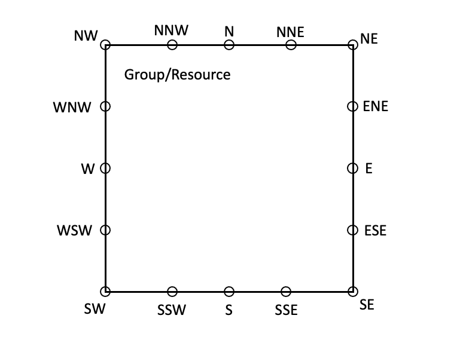
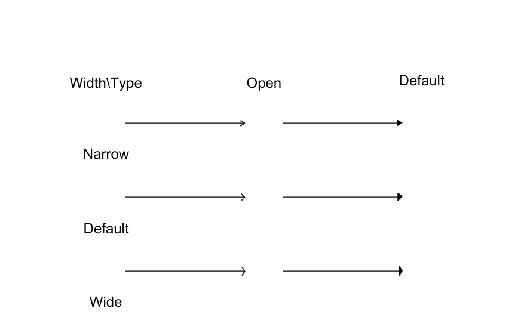

## Links

Links are lines that show relationships between resources. Currently supports a straight line between resources.

### Link position

The start and end points of the line specify the location as the 16-wind rose of the resource (for example, NNW).



```
Diagrams:
  Resources:
    ALB: ...
    PublicSubnet1Instance: ...
    PublicSubnet2Instance: ...
  Links:
    - Source: ALB # (required)
      SourcePosition: NNW # (required)
      Target: PublicSubnet1Instance # (required)
      TargetPosition: S # (required)
    - Source: ALB # (required)
      SourcePosition: NNE # (required)
      Target: PublicSubnet2Instance # (required)
      TargetPosition: S # (required)
      LineWidth: 1 # (optional)
      LineColor: 'rgba(255,255,255,255)' # (optional)
```

### Arrow head

Arrows add context and meaning to a diagram by indicating the direction of flow.


(generated from [static/arrows.yaml](static/arrows.yaml))

```
    - Source: ALB
      SourcePosition: NNW
      SourceArrowHead: #(optional)
        Type: Open #(required) Open/Default
        Width: Default #  (optional) Narrow/Default/Wide default="Default"
        Length: 2 # (optional) default=2
      Target: VPCPublicSubnet1Instance
      TargetPosition: SSE
      TargetArrowHead: #(optional)
        Type: Open #(required) Open/Default
        Width: Default #  (optional) Narrow/Default/Wide default="Default"
        Length: 2 # (optional) default=2
```
