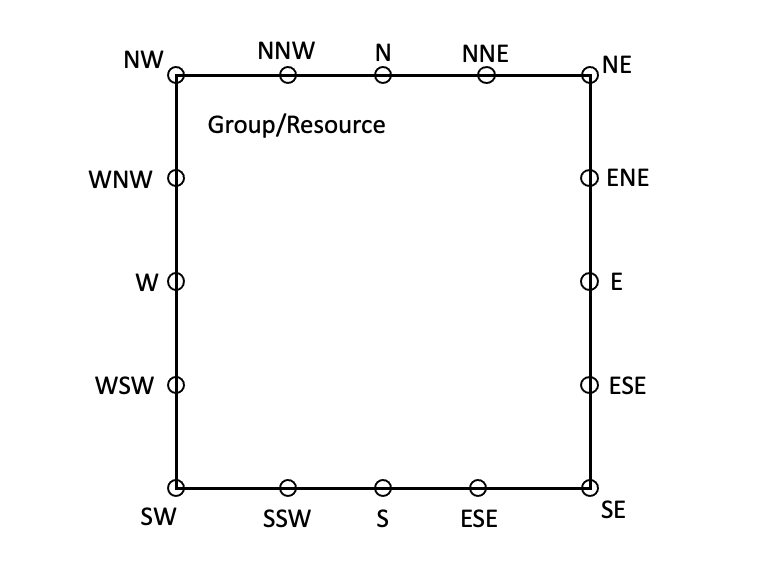

## Links

Links are lines that show relationships between resources. Currently supports a straight line between resources.

### Link position

The start and end points of the line specify the location as the 16-wind rose of the resource (for example, NNW).



### Example
```
Diagrams:
  Resources:
    ALB: ...
    PublicSubnet1Instance: ...
    PublicSubnet2Instance: ...
  Links:
    - Source: ALB
      SourcePosition: NNW
      Target: PublicSubnet1Instance
      TargetPosition: S
    - Source: ALB
      SourcePosition: NNE
      Target: PublicSubnet2Instance
      TargetPosition: S
```
