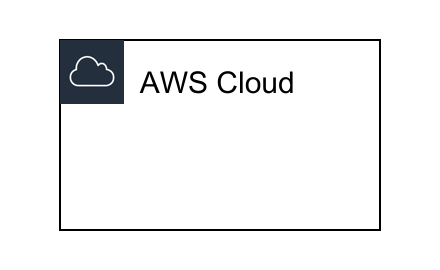
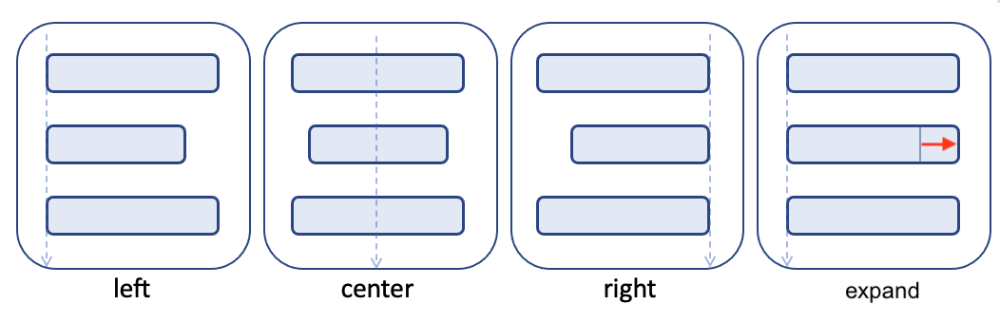
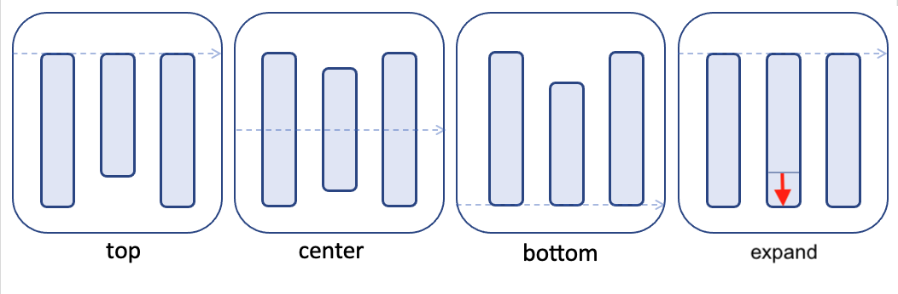

## Resouce Types
### AWS::Diagram::Canvas
Canvas is a resource type that represents a drawable area. The Canvas resource type doesn't draw anything, but it is a special resource type, and all resources must be reached from the Canvas. There must be only one Canvas resource type in the file.


### AWS::Diagram::Cloud
A resource type that indicates that it is within the AWS cloud. It is defined internally as `AWS::Diagram::Group` resource type. It is often used mainly in contrast to users and on-premises environments but is not required.



```
Diagram:
  Resources:
    Canvas:
      Type: AWS::Diagram::Canvas
      Direction: vertical
      Children:
        - AWSCloud
    AWSCloud:
      Type: AWS::Diagram::Cloud
      Preset: AWSCloudNoLogo
```

### AWS::Diagram::Group
An essential resource type that indicates that it is a group of resources. The following attributes are defined for the group, and it is possible to customize the decoration with these attributes.
`AWS::Diagram::Group` resources are often used implicitly, but it is also possible to create custom groups explicitly.

| Attribute | Type     | Default Value   | Description                                                             |
| --------- | -------- | --------------- | ----------------------------------------------------------------------- |
| Icon      | string   | ` `             | Icon file                                                               |
| Direction | string   | `horizontal`    | vertical: `left`,`center`,`right` horizontal: `top`, `center`, `bottom` |
| Preset    | string   | ` `             | Override resource attributes from preset                                |
| Align     | string   | `center`        | `vertical`, `horizontal`                                                |
| FillColor | string   | `rgba(0,0,0,0)` |                                                                         |
| Title     | string   | ` `             |                                                                         |
| Children  | []string | `[]`            |                                                                         |


### AWS::Diagram::Resource
An essential resource type that represents a single resource. The following attributes are defined for the group, and it is possible to customize the decoration with these attributes.
`AWS::Diagram::Resource` resources are often used implicitly, but it is also possible to create custom resources explicitly.

| Attribute | Type     | Default Value   | Description                                                             |
| --------- | -------- | --------------- | ----------------------------------------------------------------------- |
| Icon      | string   | ` `             | Specify icon file                                                       |
| Preset    | string   | ` `             | Override resource attributes from preset                                |
| FillColor | string   | `rgba(0,0,0,0)` |                                                                         |
| Title     | string   | ` `             |                                                                         |
| Children  | []string | `[]`            |                                                                         |

### AWS::Diagram::VerticalStack
A resource type that indicates a vertical stack. It is treated internally as a Group resource type but is undecorated by default.
`left` alignment, `center` alignment, or `right` alignment can be specified with `align` attribute when stacking.



### AWS::Diagram::HorizontalStack
A resource type that indicates a horizontal stack. It is treated internally as a Group resource type but is undecorated by default.
`top` alignment, `center` alignment, or `bottom` alignment can be specified with `align` attribute when stacking.



### Other predefined resource types
