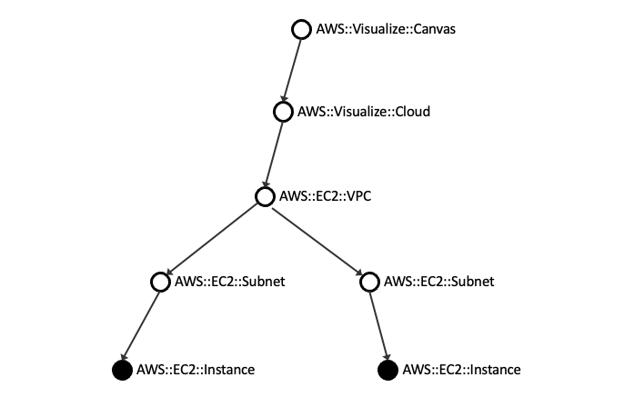
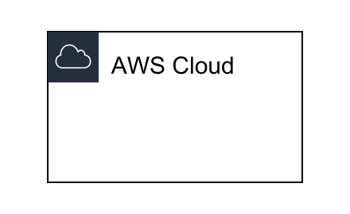
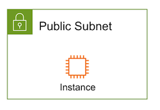
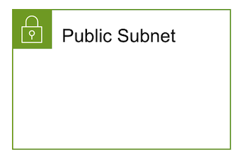
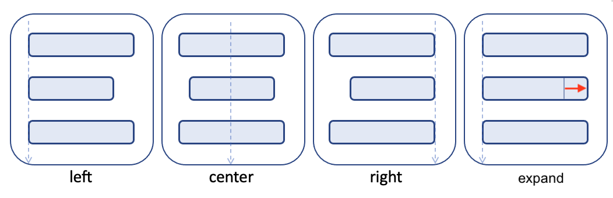
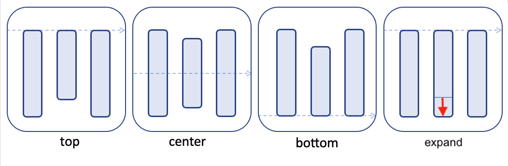

## Resouce Types

### AWS::Diagram::Canvas

Canvas is a resource type that represents a drawable area. The Canvas resource type doesn't draw anything, but it is a special resource type, and all resources must be reached from the Canvas. There must be only one Canvas resource type in the file.



### AWS::Diagram::Cloud

A resource type that indicates that it is within the AWS cloud. It is defined internally as `AWS::Diagram::Group` resource type. It is often used mainly in contrast to users and on-premises environments but is not required.



```
Diagram:
  Resources:
    Canvas:
      Type: AWS::Diagram::Canvas
      Direction: vertical
      Children:
        - AWSCloud
    AWSCloud:
      Type: AWS::Diagram::Cloud
      Preset: AWSCloudNoLogo
```

### AWS::Diagram::Group [DEPRECATED]

~~An essential resource type that indicates that it is a group of resources. The following attributes are defined for the group, and it is possible to customize the decoration with these attributes.~~
~~`AWS::Diagram::Group` resources are often used implicitly, but it is also possible to create custom groups explicitly.~~

### AWS::Diagram::Resource

An essential resource type that represents a single resource or group. The following attributes are defined for the resource, and it is possible to customize the decoration with these attributes.
`AWS::Diagram::Resource` type are used implicitly from other predefined types, but you can specify `AWS::Diagram::Resource` explicitly and create custom resources.

| Attribute      | Type          | Default Value                              | Description                                                             |
| -------------- | ------------- | ------------------------------------------ | ----------------------------------------------------------------------- |
| Icon           | string        | ` `                                        | Icon file path                                                          |
| IconFill       | IconFill      | `Type: none, Color: rgba(255,255,255,255)` | Filling icon background                                                 |
| Direction      | string        | `horizontal`                               | `vertical`, `horizontal`                                                |
| Preset         | string        | ` `                                        | Override resource attributes from preset                                |
| Align          | string        | `center`                                   | vertical: `left`,`center`,`right` horizontal: `top`, `center`, `bottom` |
| FillColor      | string        | `rgba(0,0,0,0)`                            | Only group.                                                             |
| BorderColor    | string        | `rgba(0,0,0,0)`                            |                                                                         |
| Title          | string        | ` `                                        |                                                                         |
| HeaderAlign    | string        | `left`                                     | Only group. You can align icon and title to left/center/right.          |
| Children       | []string      | `[]`                                       |                                                                         |
| BorderChildren | []borderchild | `[]`                                       | Resource children on border                                             |
| BorderType     | string        | `Straight`                                 | Border style: `Straight` or `Dashed`                                    |
| SpanResources  | []string      | `[]`                                       | Resources to span as an overlay (see [SpanResources](#spanresources-overlay)) |

#### Single resource

<table>
<tr>
<td>
<pre>
    Subnet:
      Type: AWS::EC2::Subnet
      Preset: PublicSubnet
</pre>
</td>
<td>

</td>
</tr>
</table>

#### A resource with EC2 instance children

<table>
<tr>
<td>
<pre>
    Subnet:
      Type: AWS::EC2::Subnet
      Preset: PublicSubnet
      Children:
        - Instance
    Instance:
      Type: AWS::EC2::Instance
</pre>
</td>
<td>

</td>
</tr>
</table>

#### A resource with empty resource children

<table>
<tr>
<td>
<pre>
    Subnet:
      Type: AWS::EC2::Subnet
      Preset: PublicSubnet
      Children:
        - SubnetEmptyResource
    SubnetEmptyResource:
      Type: AWS::Diagram::Resource
</pre>
</td>
<td>

</td>
</tr>
</table>

### AWS::Diagram::VerticalStack

A resource type that indicates a vertical stack. It is treated internally as a Group resource type but is undecorated by default.
`left` alignment, `center` alignment, or `right` alignment can be specified with `align` attribute when stacking.



### AWS::Diagram::HorizontalStack

A resource type that indicates a horizontal stack. It is treated internally as a Group resource type but is undecorated by default.
`top` alignment, `center` alignment, or `bottom` alignment can be specified with `align` attribute when stacking.



### SpanResources (Overlay)

SpanResources allows a resource to be drawn as a visual overlay that spans across multiple other resources. Unlike regular parent-child relationships, an overlay does not affect layout — it calculates the union bounding box of its target resources and draws a border, icon, and label on top of the rendered diagram.

This is useful for representing logical groupings that cut across the resource hierarchy, such as an Auto Scaling Group spanning multiple subnets.

| Attribute     | Type     | Description                                                    |
| ------------- | -------- | -------------------------------------------------------------- |
| SpanResources | []string | List of resource names that the overlay spans across           |
| BorderType    | string   | Border style: `Straight` (default) or `Dashed`                |
| BorderColor   | string   | Border color (defaults to opaque black if not specified)       |
| Title         | string   | Label displayed in the overlay header alongside the icon       |

#### Example: Auto Scaling Group overlay

<table>
<tr>
<td>
<pre>
    PublicSubnet1:
      Type: AWS::EC2::Subnet
      Children:
        - Instance1
    PublicSubnet2:
      Type: AWS::EC2::Subnet
      Children:
        - Instance2
    Instance1:
      Type: AWS::EC2::Instance
    Instance2:
      Type: AWS::EC2::Instance

    # Overlay spanning both subnets
    ASG:
      Type: AWS::AutoScaling::AutoScalingGroup
      BorderType: Dashed
      SpanResources:
        - PublicSubnet1
        - PublicSubnet2
</pre>
</td>
</tr>
</table>

The overlay resource (`ASG`) is not added as a child of any resource. It is defined at the same level as other resources and references its targets via `SpanResources`. The overlay is drawn after the main diagram layout is complete.

### BorderType

BorderType controls the border style for both regular resources and overlay resources.

| Value      | Description                              |
| ---------- | ---------------------------------------- |
| `Straight` | Solid continuous border line (default)   |
| `Dashed`   | Dashed border line                       |

### Other predefined resource types
