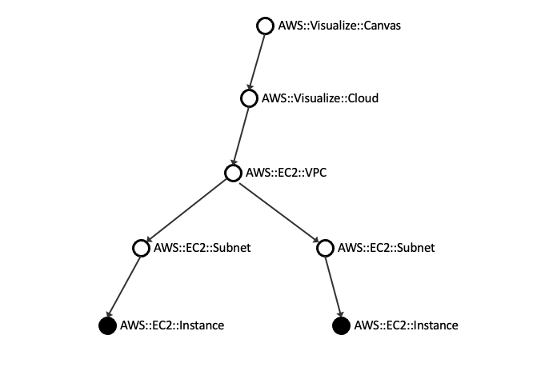
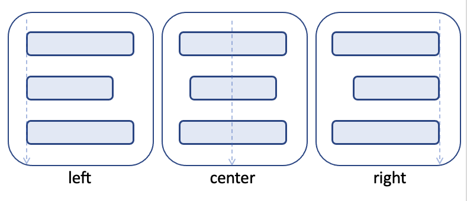
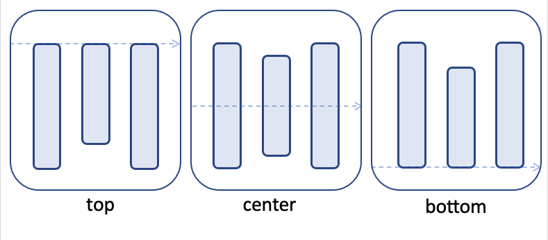

## Resouce Types
### AWS::Diagram::Canvas
Canvas is a resource type that represents a drawable area. The Canvas resource type doesn't draw anything, but it is a special resource type, and all resources must be reached from the Canvas. There must be only one Canvas resource type in the file.



### AWS::Diagram::Cloud
A resource type that indicates that it is within the AWS cloud. It is defined internally as `AWS::Diagram::Group` resource type. It is often used mainly in contrast to users and on-premises environments but is not required.


```
Diagram:
  Resources:
    Canvas:
      Type: AWS::Diagram::Canvas
      Direction: vertical
      Children:
        - AWSCloud
    AWSCloud:
      Type: AWS::Diagram::Cloud
      Preset: AWSCloudNoLogo
```

### AWS::Diagram::Group
An essential resource type that indicates that it is a group of resources. The following attributes are defined for the group, and it is possible to customize the decoration with these attributes.
`AWS::Diagram::Group` resources are often used implicitly, but it is also possible to create custom groups explicitly.


| Attribute   | Type              | Default value                                        |
| ----------- | ----------------- | ---------------------------------------------------- |
| bindings    | `image.Rectangle` | `image.Rectangle{image.Point{0,0},image.Point{0,0}}` |
| iconImage   | `image.Image`     | `nil`                                                |
| iconBounds  | `image.Rectangle` | `image.Rectangle{image.Point{0,0},image.Point{0,0}}` |
| borderColor | `color.RGBA`      | `color.RGBA{0, 0, 0, 0}`                             |
| fillColor   | `color.RGBA`      | `color.RGBA{0, 0, 0, 0}`                             |
| label       | `string`          | `""`                                                 |
| fontColor   | `color.RGBA`      | `color.RGBA{0, 0, 0, 0}`                             |
| width       | `int`             | `320`                                                |
| height      | `int`             | `190`                                                |
| margin      | `Margin`          | `Margin{20, 15, 20, 15}`                             |
| padding     | `Padding`         | `Padding{20, 45, 20, 45}`                            |
| direction   | `string`          | `"vertical"`                                         |
| align       | `string`          | `"center"`                                           |
| links       | `[]*Link`         | `[]`                                                 |
| children    | `[]Node`          | `[]`                                                 |
| drawn       | `bool`            | `false`                                              |

### AWS::Diagram::Resource
An essential resource type that represents a single resource. The following attributes are defined for the group, and it is possible to customize the decoration with these attributes.
`AWS::Diagram::Resource` resources are often used implicitly, but it is also possible to create custom resources explicitly.

| Attribute   | Type              | Default value                                          |
| ----------- | ----------------- | ------------------------------------------------------ |
| bindings    | `image.Rectangle` | `image.Rectangle{image.Point{0,0},image.Point{0,0}}`   |
| iconImage   | `image.Image`     | `nil`                                                  |
| iconBounds  | `image.Rectangle` | `image.Rectangle{image.Point{0,0},image.Point{64,64}}` |
| borderColor | `color.RGBA`      | `color.RGBA{0, 0, 0, 0}`                               |
| fillColor   | `color.RGBA`      | `color.RGBA{0, 0, 0, 0}`                               |
| label       | `string`          | `""`                                                   |
| fontColor   | `color.RGBA`      | `color.RGBA{0, 0, 0, 0}`                               |
| width       | `int`             | `64`                                                   |
| height      | `int`             | `64`                                                   |
| margin      | `Margin`          | `Margin{30, 100, 30, 100}`                             |
| padding     | `Padding`         | `Padding{0, 0, 0, 0}`                                  |
| links       | `[]*Link`         | `[]`                                                   |
| drawn       | `bool`            | `false`                                                |

### AWS::Diagram::VerticalStack
A resource type that indicates a vertical stack. It is treated internally as a Group resource type but is undecorated by default.
`left` alignment, `center` alignment, or `right` alignment can be specified with `align` attribute when stacking.



### AWS::Diagram::HorizontalStack
A resource type that indicates a horizontal stack. It is treated internally as a Group resource type but is undecorated by default.
`top` alignment, `center` alignment, or `bottom` alignment can be specified with `align` attribute when stacking.



### Other predefined resource types


