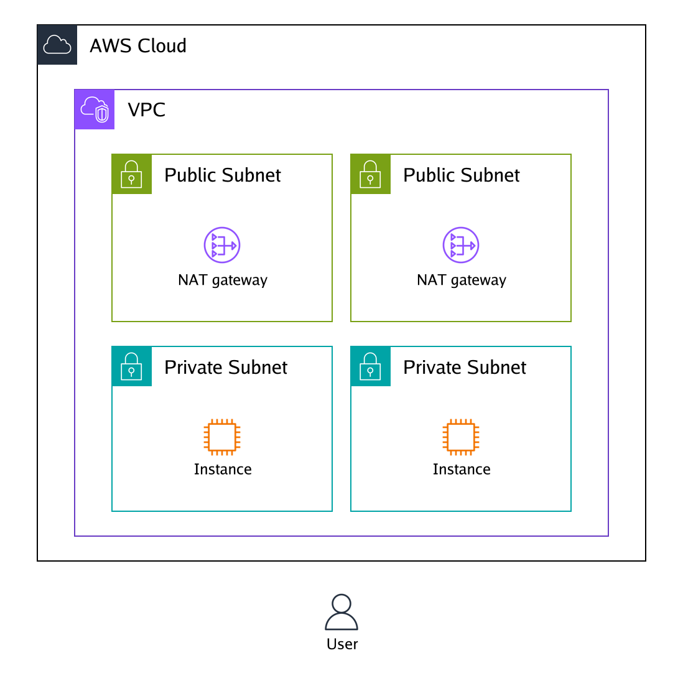
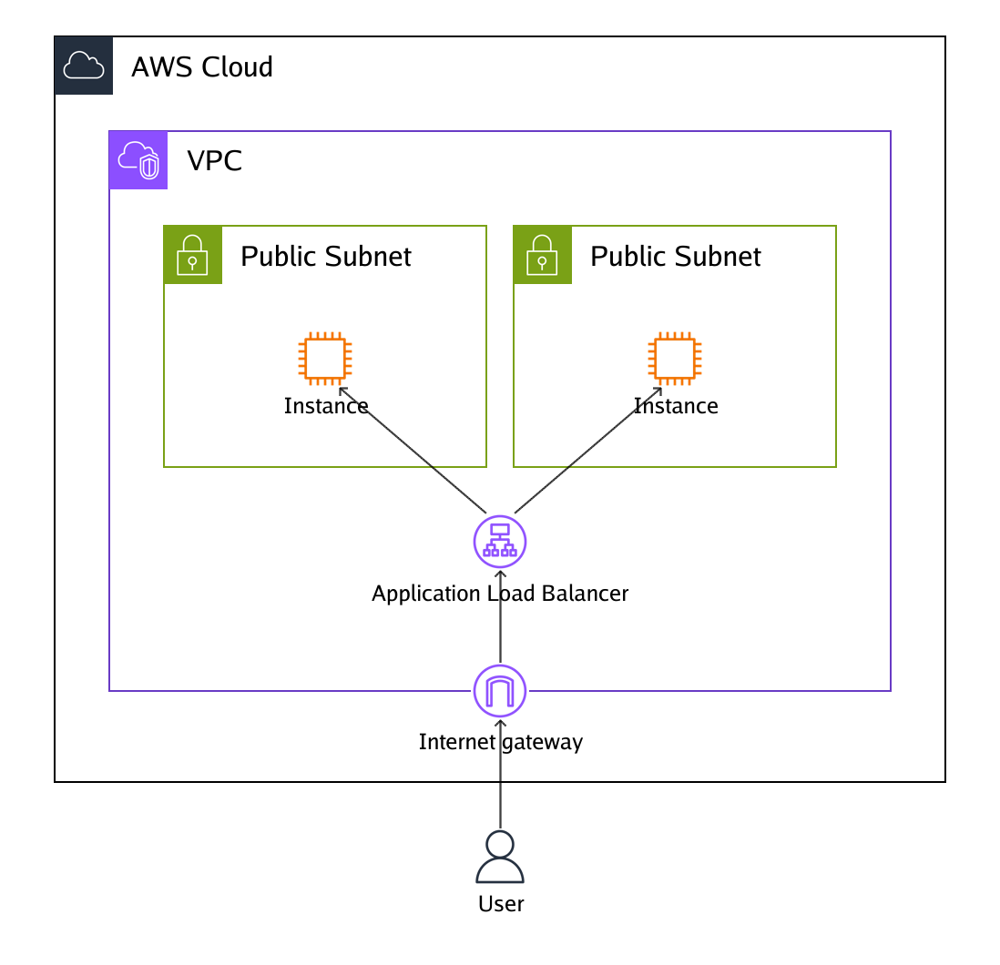
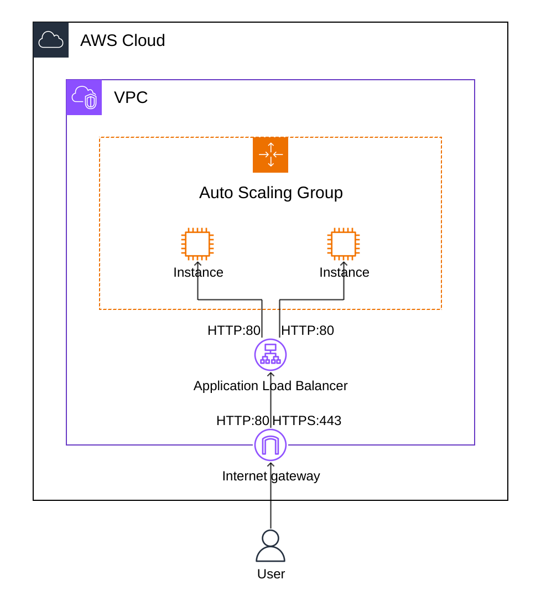
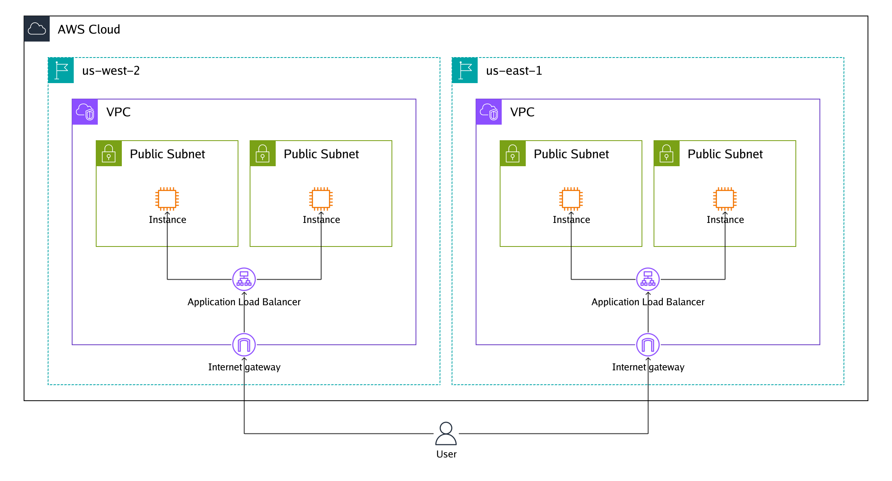
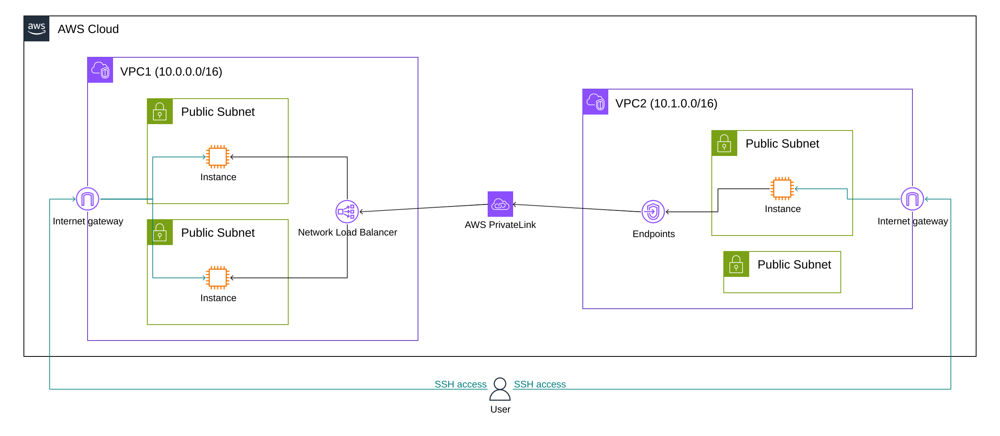
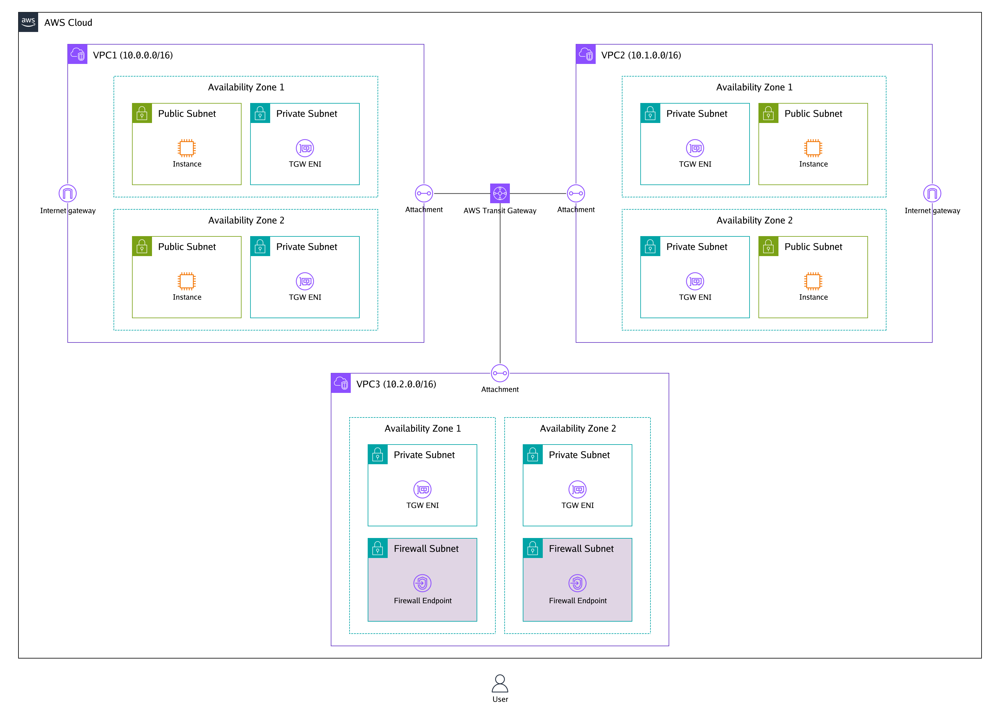
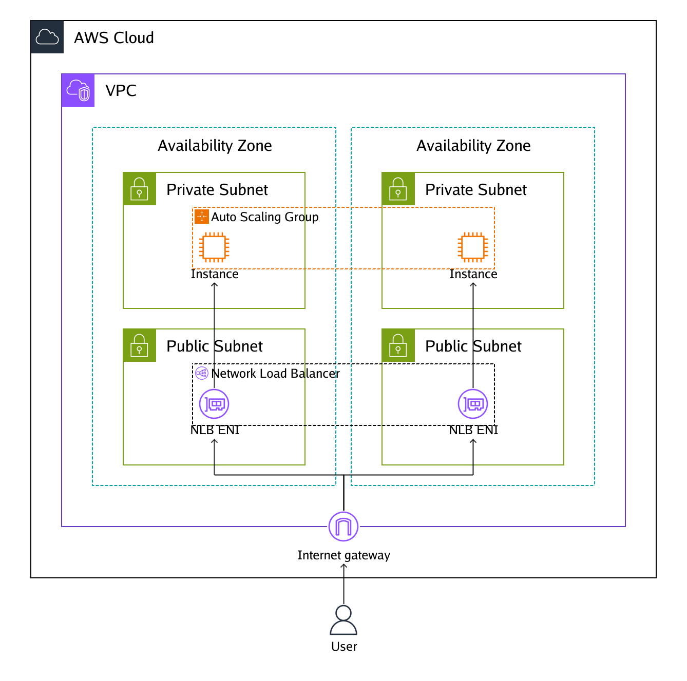
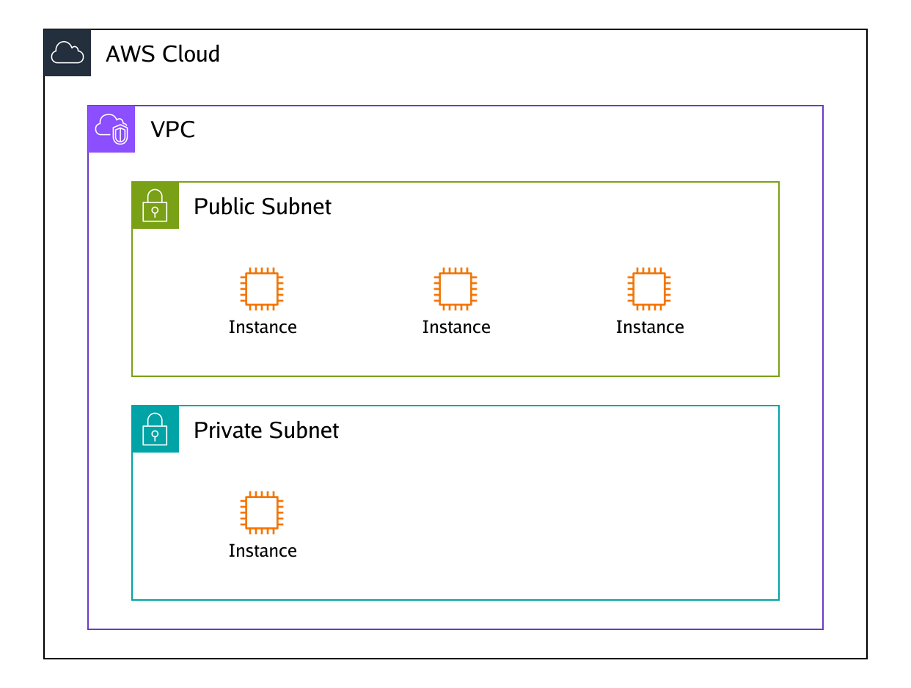
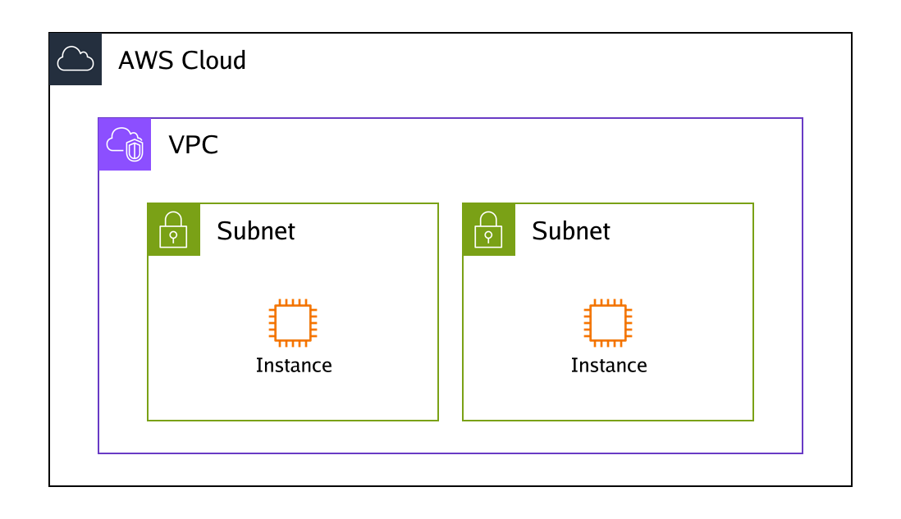

# Examples

## Private instance communicating with the internet through a NAT gateway

(generated from [vpc-natgw.yaml](vpc-natgw.yaml))

## Load balancing web servers using ALB

(generated from [alb-ec2.yaml](alb-ec2.yaml))

## Load balancing an Auto Scaling group of web servers using ALB

(generated from [alb-asg.yaml](alb-asg.yaml))

## Multi-region redundancy

(generated from [multi-region.yaml](multi-region.yaml))

## PrivateLink between VPCs

(generated from [privatelink.yaml](privatelink.yaml))

## Network firewall that inspects communication between VPCs

(generated from [tgw-nwfw-tmpl.yaml](tgw-nwfw-tmpl.yaml))

## A load balancer spanning multiple subnets

(generated from [span-resources.yaml](span-resources.yaml))

## Expanding a group to fill its parent with Align: expand

(generated from [expand-align.yaml](expand-align.yaml))

## EC2 instances in a VPC, generated from a CloudFormation template

(generated from CloudFormation template [vpc-subnet-ec2-cfn.yaml](vpc-subnet-ec2-cfn.yaml))
