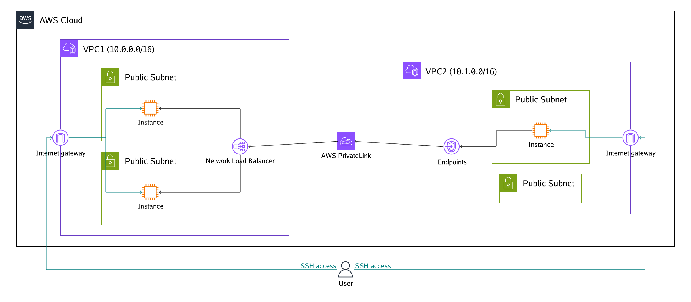
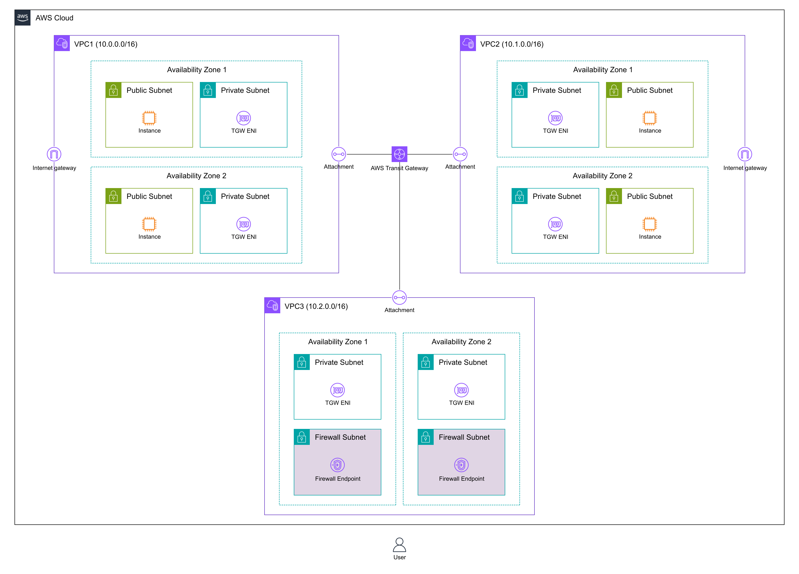

# Examples

## Private instance communicating with the internet through a NAT gateway

(generated from [vpc-natgw.yaml](vpc-natgw.yaml))

## Load balancing web servers using ALB

(generated from [alb-ec2.yaml](alb-ec2.yaml))

## Multi-region redundancy

(generated from [multi-region.yaml](multi-region.yaml))

## PrivateLink between VPCs

(generated from [privatelink.yaml](privatelink.yaml))

## Network firewall that inspects communication between VPCs

(generated from [tgw-nwfw.yaml](tgw-nwfw.yaml))
